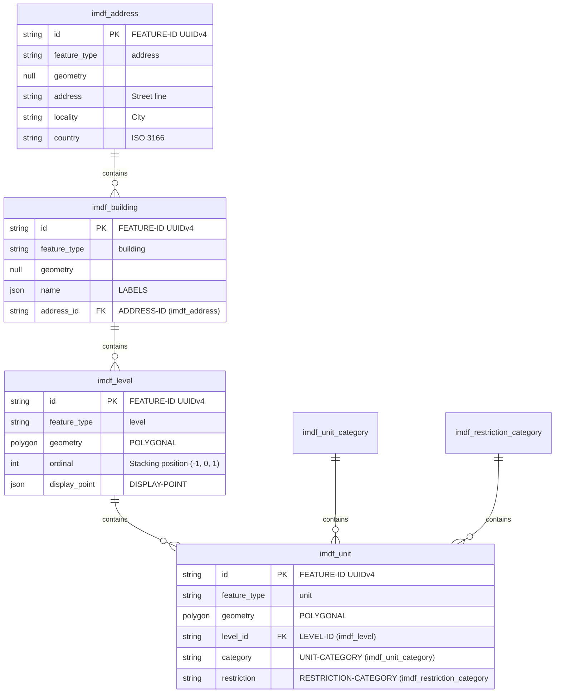

```mermaid
erDiagram
    imdf_address ||--o{ imdf_building : contains
    imdf_building ||--o{ imdf_level : contains
    imdf_level ||--o{ imdf_unit : contains
    imdf_unit_category ||--o{ imdf_unit : contains
    imdf_restriction_category ||--o{ imdf_unit : contains

    %% https://docs.ogc.org/cs/20-094/Address/index.html
    imdf_address {
        string id PK "FEATURE-ID UUIDv4"
        string feature_type "address"
        null geometry
        string address "Street line"
        string locality "City"
        string country "ISO 3166"
    }

    %% https://docs.ogc.org/cs/20-094/Building/index.html
    %% name uses JSON if the label is different in another language i.e. AAU Copenhagen vs AAU København
    imdf_building {
        string id PK "FEATURE-ID UUIDv4"
        string feature_type "building"
        null geometry
        json name "LABELS"
        string address_id FK "ADDRESS-ID (imdf_address)"
    }

    %% https://docs.ogc.org/cs/20-094/Level/index.html
    imdf_level {
        string id PK "FEATURE-ID UUIDv4"
        string feature_type "level"
        polygon geometry "POLYGONAL"
        int ordinal "Stacking position (-1, 0, 1)"
        json display_point "DISPLAY-POINT"
    }

    %% https://docs.ogc.org/cs/20-094/Categories/index.html#unit
    imdf_unit_category

    %% https://docs.ogc.org/cs/20-094/Categories/index.html#restriction
    imdf_restriction_category

    %% https://docs.ogc.org/cs/20-094/Unit/index.html
    imdf_unit {
        string id PK "FEATURE-ID UUIDv4"
        string feature_type "unit"
        polygon geometry "POLYGONAL"
        string level_id FK "LEVEL-ID (imdf_level)"
        string category "UNIT-CATEGORY (imdf_unit_category)"
        string restriction "RESTRICTION-CATEGORY (imdf_restriction_category"
    }
```
