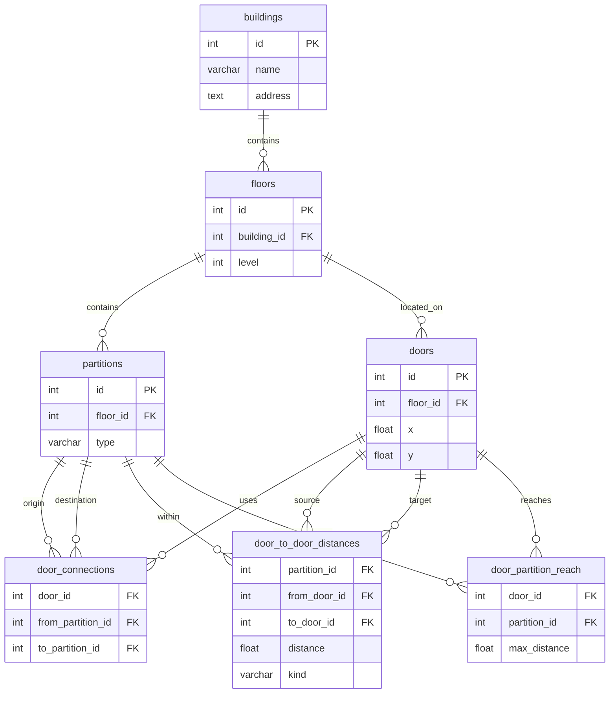

```mermaid
erDiagram
    buildings ||--o{ floors : contains
    floors ||--o{ partitions : contains
    floors ||--o{ doors : located_on
    partitions ||--o{ door_connections : origin
    partitions ||--o{ door_connections : destination
    doors ||--o{ door_connections : uses
    partitions ||--o{ door_to_door_distances : within
    doors ||--o{ door_to_door_distances : source
    doors ||--o{ door_to_door_distances : target
    doors ||--o{ door_partition_reach : reaches
    partitions ||--o{ door_partition_reach : reachable_from

    buildings {
        int id PK
        varchar name
        text address
    }
    floors {
        int id PK
        int building_id FK
        int level
    }
    partitions {
        int id PK
        int floor_id FK
        varchar type
    }
    doors {
        int id PK
        int floor_id FK
        float x
        float y
    }
    door_connections {
        int door_id FK
        int from_partition_id FK
        int to_partition_id FK
    }
    door_to_door_distances {
        int partition_id FK
        int from_door_id FK
        int to_door_id FK
        float distance
        varchar kind
    }
    door_partition_reach {
        int door_id FK
        int partition_id FK
        float max_distance
    }

```
