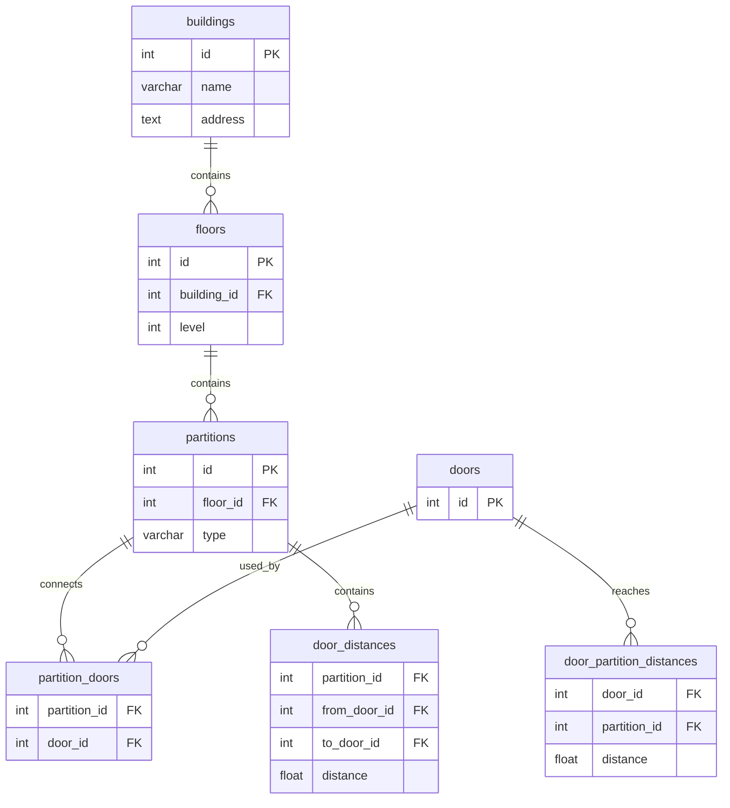

```mermaid
erDiagram
    buildings ||--o{ floors : contains
    floors ||--o{ partitions : contains
    partitions ||--o{ partition_doors : connects
    doors ||--o{ partition_doors : used_by
    partitions ||--o{ door_distances : contains
    doors ||--o{ door_partition_distances : reaches

    buildings {
        int id PK
        varchar name
        text address
    }

    floors {
        int id PK
        int building_id FK
        int level
    }

    partitions {
        int id PK
        int floor_id FK
        varchar type
    }

    doors {
        int id PK
    }

    partition_doors {
        int partition_id FK
        int door_id FK
    }

    door_distances {
        int partition_id FK
        int from_door_id FK
        int to_door_id FK
        float distance
    }

    door_partition_distances {
        int door_id FK
        int partition_id FK
        float distance
    }
```
