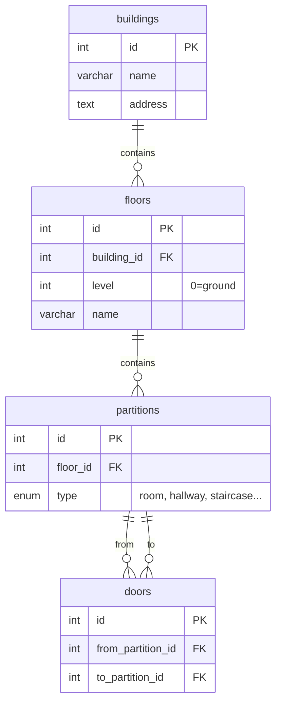

```mermaid
erDiagram
    buildings ||--o{ floors : contains
    floors ||--o{ partitions : contains

    partitions ||--o{ doors : "from"
    partitions ||--o{ doors : "to"

    buildings {
        int id PK
        varchar name
        text address
    }

    floors {
        int id PK
        int building_id FK
        int level "0=ground"
        varchar name
    }

    partitions {
        int id PK
        int floor_id FK
        enum type "room, hallway, staircase..."
    }

    doors {
        int id PK
        int from_partition_id FK
        int to_partition_id FK
    } 

```
