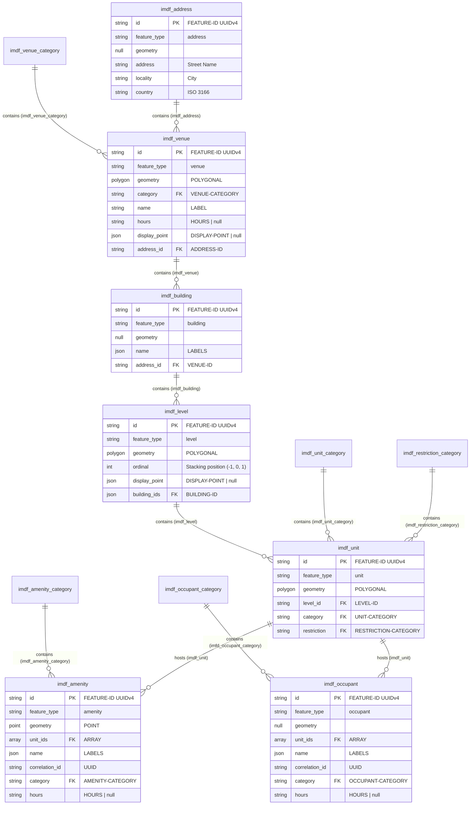

```mermaid
erDiagram
    %% https://docs.ogc.org/cs/20-094/Categories/index.html#venue
    imdf_venue_category

    imdf_venue_category ||--o{ imdf_venue : "contains (imdf_venue_category)"
    imdf_address ||--o{ imdf_venue : "contains (imdf_address)"

    imdf_venue {
        string id PK "FEATURE-ID UUIDv4"
        string feature_type "venue"
        polygon geometry "POLYGONAL"
        string category FK "VENUE-CATEGORY"
        string name "LABEL"
        string hours "HOURS | null"
        json display_point "DISPLAY-POINT | null"
        string address_id FK "ADDRESS-ID"
    }

    %% https://docs.ogc.org/cs/20-094/Categories/index.html#occupant
    imdf_occupant_category

    %% https://docs.ogc.org/cs/20-094/Categories/index.html#unit
    imdf_unit_category

    %% https://docs.ogc.org/cs/20-094/Categories/index.html#restriction
    imdf_restriction_category

    imdf_amenity_category

    imdf_venue ||--o{ imdf_building : "contains (imdf_venue)"

    %% https://docs.ogc.org/cs/20-094/Address/index.html
    imdf_address {
        string id PK "FEATURE-ID UUIDv4"
        string feature_type "address"
        null geometry
        string address "Street Name"
        string locality "City"
        string country "ISO 3166"
    }

    %% https://docs.ogc.org/cs/20-094/Building/index.html
    %% https://docs.ogc.org/cs/20-094/Reference/index.html#labels
    %% name uses JSON if the label is different in another language i.e. AAU Copenhagen vs AAU København
    imdf_building {
        string id PK "FEATURE-ID UUIDv4"
        string feature_type "building"
        null geometry
        json name "LABELS"
        string address_id FK "VENUE-ID"
    }

    imdf_building ||--o{ imdf_level : "contains (imdf_building)"

    %% https://docs.ogc.org/cs/20-094/Level/index.html
    %% https://docs.ogc.org/cs/20-094/Reference/index.html#display-point
    imdf_level {
        string id PK "FEATURE-ID UUIDv4"
        string feature_type "level"
        polygon geometry "POLYGONAL"
        int ordinal "Stacking position (-1, 0, 1)"
        json display_point "DISPLAY-POINT | null"
        json building_ids FK "BUILDING-ID"
    }

    imdf_level ||--o{ imdf_unit : "contains (imdf_level)"
    imdf_unit_category ||--o{ imdf_unit : "contains (imdf_unit_category)"
    imdf_restriction_category ||--o{ imdf_unit : "contains (imdf_restriction_category)"

    %% https://docs.ogc.org/cs/20-094/Unit/index.html
    imdf_unit {
        string id PK "FEATURE-ID UUIDv4"
        string feature_type "unit"
        polygon geometry "POLYGONAL"
        string level_id FK "LEVEL-ID"
        string category FK "UNIT-CATEGORY"
        string restriction FK "RESTRICTION-CATEGORY"
    }

    imdf_amenity_category ||--o{ imdf_amenity : "contains (imdf_amenity_category)"
    imdf_unit ||--o{ imdf_amenity : "hosts (imdf_unit)"
    %%imdf_address ||--o{ imdf_amenity : "contains "

    %% https://docs.ogc.org/cs/20-094/Categories/index.html#amenity
    imdf_amenity {
        string id PK "FEATURE-ID UUIDv4"
        string feature_type "amenity"
        point geometry "POINT"
        array unit_ids FK "ARRAY"
        %%string address_id FK "ADDRESS-ID"
        json name "LABELS"
        string correlation_id "UUID"
        string category FK "AMENITY-CATEGORY"
        string hours "HOURS | null"
    }

    imdf_occupant_category ||--o{ imdf_occupant : "contains (imfd_occupant_category)"
    imdf_unit ||--o{ imdf_occupant : "hosts (imdf_unit)"

    %% https://docs.ogc.org/cs/20-094/Occupant/index.html
    imdf_occupant {
        string id PK "FEATURE-ID UUIDv4"
        string feature_type "occupant"
        null geometry
        array unit_ids FK "ARRAY"
        json name "LABELS"
        string correlation_id "UUID"
        string category FK "OCCUPANT-CATEGORY"
        string hours "HOURS | null"
    }

```
